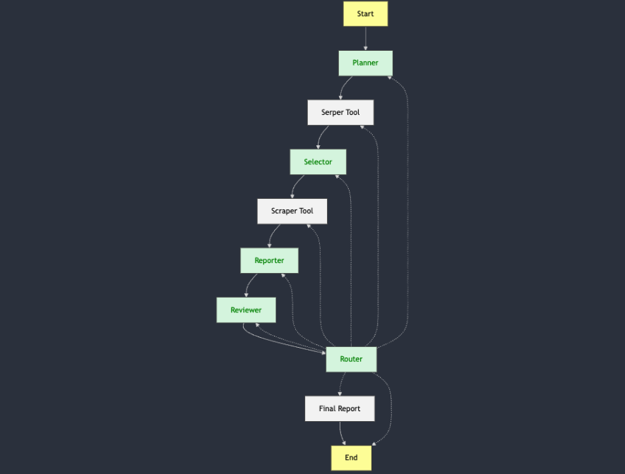

# Agentic Search

**Multi-agent research search** — Ask a question, and a team of AI agents plans searches, fetches results, scrapes pages, writes cited reports, and iterates until the answer is solid.

---

## What It Does

Agentic Search turns a single research question into a full research pipeline. Instead of one generic search, specialized agents:

- **Plan** the best search strategy and query
- **Search** the web via Google Serper
- **Select** the most relevant result from the SERP
- **Scrape** the chosen page for content
- **Report** an answer with citations
- **Review** the report and decide: done, or loop back to improve

You get a **cited, reviewed answer** that can go through multiple refinement loops (new searches, different sources, or better writing) until quality is acceptable.

---

## Features

- **Multi-agent workflow** — Planner, Selector, Reporter, Reviewer, and Router agents with clear roles
- **Live web search** — Google Serper API for real search results
- **Page scraping** — Fetches and parses the selected URL (BeautifulSoup), with error handling and content limits
- **Review loop** — Reviewer checks reports; Router sends work back to Planner, Selector, or Reporter as needed
- **Structured outputs** — Agents use JSON schemas (Groq JSON mode) for reliable parsing and routing
- **Streamlit UI** — Chat-style interface; you ask a question and see each agent’s output as it runs
- **Configurable LLM** — Built for Groq (e.g. `llama3-8b-8192`); API keys via `config/config.yaml`

---

## Workflow

End-to-end flow from your question to the final report:



1. **Planner** — Turns your question into a search term and strategy.
2. **Serper** — Runs the search and returns organic results (title, link, snippet).
3. **Selector** — Picks one result and returns its URL.
4. **Scraper** — Downloads and parses that page (text, length limit, error handling).
5. **Reporter** — Writes an answer with citations from the scraped content.
6. **Reviewer** — Evaluates the report (comprehensiveness, citations, relevance).
7. **Router** — Chooses next step: **final_report** (done), or loop back to **planner** / **selector** / **reporter**.
8. **Final report** — When the Router decides done, the last report is shown as the answer.

---

## Prerequisites

- **Python 3.x**
- **API keys**
  - [Groq](https://console.groq.com/) — for the LLM (e.g. Llama 3)
  - [Serper](https://serper.dev/) — for Google search results

---

## Setup

1. **Clone and enter the repo**

   ```bash
   git clone https://github.com/omkarjoshi9/Agentic_Search.git
   cd "Agentic Search"
   ```

2. **Create a virtual environment (recommended)**

   ```bash
   python -m venv venv
   # Windows
   venv\Scripts\activate
   # macOS/Linux
   source venv/bin/activate
   ```

3. **Install dependencies**

   ```bash
   pip install -r requirements.txt
   ```

4. **Configure API keys**

   Edit `config/config.yaml` and set your keys (do not commit real keys):

   ```yaml
   groq_api_key: "your-groq-api-key"
   serper_api_key: "your-serper-api-key"
   openai_api_key: ""   # optional, for future use
   ```

---

## Usage

From the project root:

```bash
streamlit run app/app.py
```

Then:

1. Open the URL shown in the terminal (usually `http://localhost:8501`).
2. Type your research question in the chat input (e.g. *"Why is the sky blue?"*).
3. Watch the agents run: Planner → Serper → Selector → Scraper → Reporter → Reviewer → Router, with optional loops.
4. Read the **Final Report** when the workflow finishes.

---

## Project Structure

```
Agentic Search/
├── app/
│   └── app.py              # Streamlit entry point, runs the workflow
├── agent_graph/
│   └── graph.py            # LangGraph definition (nodes, edges, router)
├── agents/
│   └── agents.py           # Planner, Selector, Reporter, Reviewer, Router, FinalReport, End
├── config/
│   └── config.yaml         # API keys (groq, serper, openai)
├── models/
│   └── groq_models.py      # Groq LLM wrappers (JSON and plain)
├── prompts/
│   └── prompts.py          # System prompts and JSON schemas per agent
├── states/
│   └── state.py            # AgentGraphState and state helpers
├── tools/
│   ├── google_serper.py    # Serper API client
│   └── basic_scraper.py    # HTTP fetch + BeautifulSoup scraping
├── utils/
│   ├── steamlit.py         # Streamlit UI (input, message queue, display)
│   ├── message_queue.py    # Queue for agent messages to the UI
│   └── helper_functions.py # Config loading, datetime, content checks
├── images/
│   └── image.png           # Workflow diagram
├── requirements.txt
└── readme.md
```

---

## Tech Stack

| Layer        | Technology |
|-------------|------------|
| Orchestration | **LangGraph** (state graph, conditional routing) |
| LLM          | **Groq** (e.g. Llama 3 8B), JSON and text modes |
| Search       | **Serper** (Google search API) |
| Scraping     | **requests** + **BeautifulSoup** |
| UI           | **Streamlit** |
| Config       | **YAML** (`config/config.yaml`) |

---

## Configuration

- **LLM** — In `app/app.py`: `server`, `model`, and optional `model_endpoint`.
- **Loop limit** — In `app/app.py`: `limit = {"recursion_limit": iterations}` (e.g. 40) to cap review loops.
- **API keys** — All in `config/config.yaml`; loaded into env by `load_config()` in the tools/models that need them.

---

## License

See the repository license file for terms of use.
